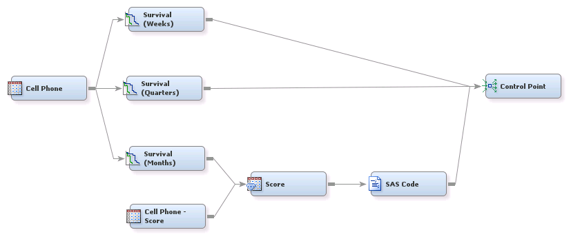

## Survival Analysis

##### Example 1: Survival Analysis Using SAS&reg; Enterprise Miner&trade;

The goal is to estimate when customers will cancel their subscription (churn). Estimating when customers will cancel 
subscriptions (as opposed to predicting which customers will cancel or whether they will cancel) enables you to view 
trends in time about churn and make decisions accordingly. Survival analysis can also be used to model other types of 
events or failures (for example, when objects will break or become unusable). This process flow diagram examines the 
use of the Survival node without the use of time-varying covariates.

***

##### Example 2: Survival Analysis with Time-Varying Covariates Using SAS&reg; Enterprise Miner&trade;

The goal is to determine when a customer is most likely to upgrade. Estimating when customers upgrade (as 
opposed to whether they upgrade) enables you to view upgrade trends in time and make decisions accordingly. This example 
examines the use of the Survival node with time-varying covariates incorporated to potentially improve the model.

***

License: <http://www.apache.org/licenses/LICENSE-2.0>